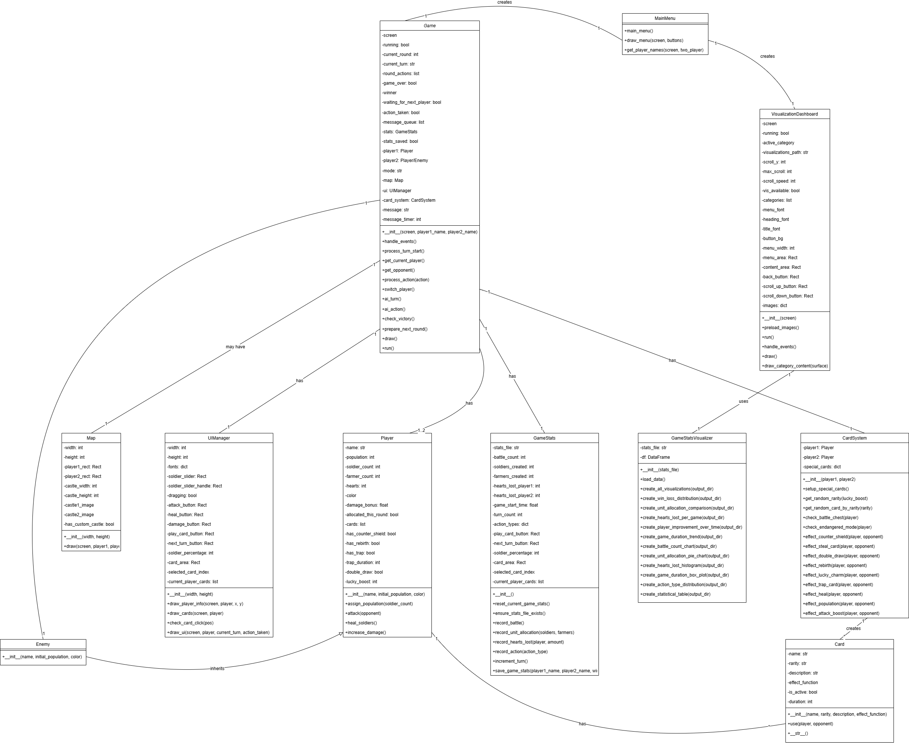

# Castle War Game

## Project Overview and Concept

Castle War Game is a turn-based strategy game where players manage resources, build armies, and battle to destroy their opponent's castle. The game combines resource allocation mechanics, strategic decision-making, and a unique card system to create an engaging gameplay experience.

### Core Features:

- **Resource Management**: Players allocate population between soldiers (for attacking) and farmers (for healing and boosting damage)
- **Turn-Based Combat**: Strategy-focused gameplay with alternating turns
- **Dynamic Progression**: Population increases each round, enabling evolving strategies
- **Special Card System**: Collect and play cards with powerful effects like Counter Shield, Trap Card, and Rebirth
- **Data Visualization**: Comprehensive statistics tracking and visualization dashboard

### Game Modes:

- **Single-Player**: Battle against an AI opponent
- **Two-Player**: Local multiplayer on the same computer

### Technical Highlights:

- Built with Python and Pygame for cross-platform compatibility
- Modular architecture with separate components for game logic, card system, and UI
- Advanced statistics tracking system with data visualization using Matplotlib and Seaborn
- Interactive visualization dashboard with categorized navigation

## UML Class Diagram

##  Demo Video

Watch our gameplay demo here:  
[📺 YouTube - castle war game](https://youtu.be/1ZOEuT0rAVg)

---

##  GitHub

My GitHub is here:
[Castle-war-game on GitHub](https://github.com/dackmer/Castle-war-game.git)

--
